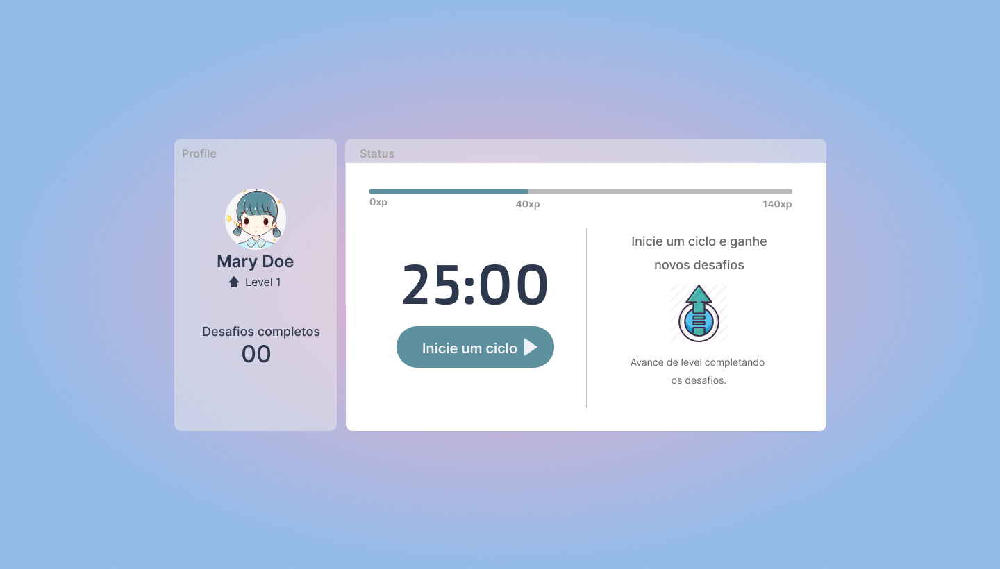

# NLWK#4 - Next Level Week 4 🚀

### Projeto 📋
O aplicativo desenvolvido nesse workshop é um Pomodoro, aplicativo usado para gestão de tempo. ([Técnica de pomodoro](https://pt.wikipedia.org/wiki/T%C3%A9cnica_pomodoro)).

### Aulas 📝
 - **Aula 01: Rumo ao próximo nível** ✅
   - Setup para o primeiro component.
 - **Aula 02: Desvendando o Next.js** ✅
   - Regras de uso e setup do NextJS.
 - **Aula 03: Contexto e componentes** ✅
 - **Aula 04: Melhorando a usabilidade da aplicaçãos** ✅
 - **Aula 05:  Próximo nível com React** ✅